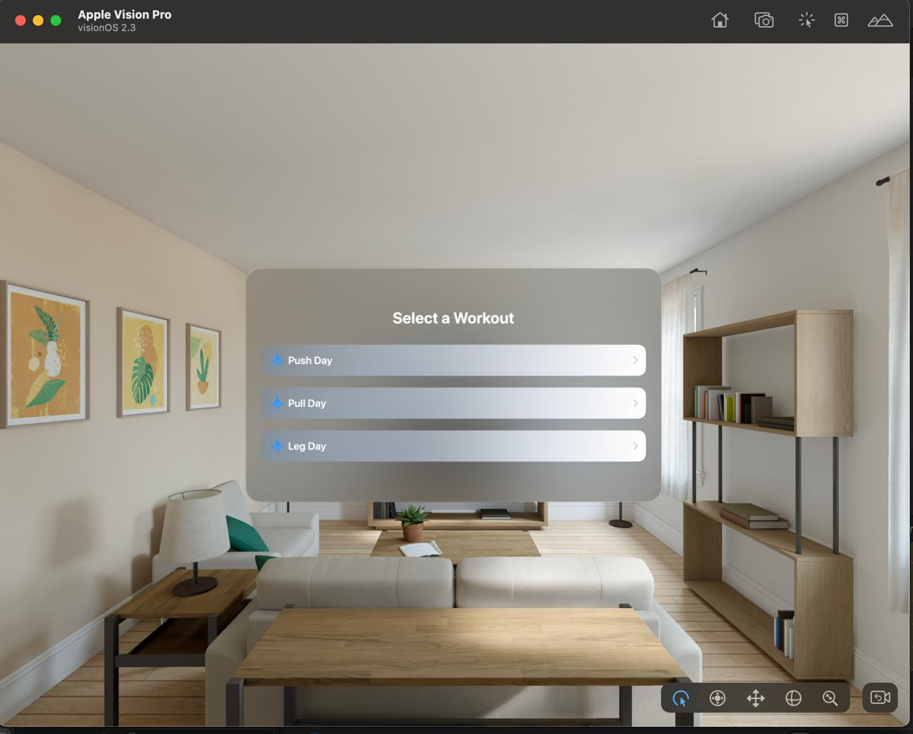
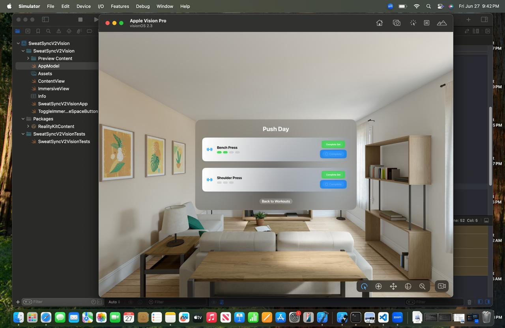

# Project Name - SweatSync VisionOS App


#### 01. Brief Description of Project - 
SweatSyncV2Vision is an immersive workout-tracking experience designed for Apple Vision Pro. It extends traditional workout planning with a 3D, spatial interface, showing progress bars, workout lists, and real-time rep tracking. Users can interact with floating 3D bars to simulate repetitions and visualize their progress through an immersive environment built using RealityKit and SwiftUI.

---

#### 02. Users of the System - 
- Fitness enthusiasts
- Home gym users
- Physiotherapists or personal trainers supervising remote workouts
- Vision Pro early adopters interested in gamified health tracking

---

#### 03. What is unique about your solution -

- Uses a **Vision Pro immersive space** to make workout progress visible and interactive  
- 3D animated bars dynamically grow to simulate repetitions  
- Tap gestures to progress through rep cycles  
- Combines immersive visualization with a workout selector and set-tracking  
- Offers a futuristic and engaging workout experience beyond 2D interfaces

---
#### 04. Briefly document the functionality of the screens you have (Include screen shots of images)

**Home (Workout Selection)**  




-This screen displays a list of available workout categories including Push Day, Pull Day, and Leg Day. Users can easily select their preferred workout by tapping the corresponding button. The clear and modern spatial UI supports intuitive navigation on Vision Pro.

---

**Workout Details (Exercise View)**  



After selecting Push Day, this screen shows the list of exercises within that workout (e.g., Bench Press, Shoulder Press). Users can track progress by marking sets as completed. A capsule-style progress indicator is shown for each exercise, with a button to complete or finish sets.

---

**Completed Workout Progress (Exercise View)**  


This screen displays the Push Day workout with all exercises marked as completed. It provides instant feedback to users with visual cues (green “Done” indicators) to confirm all sets have been finished. The interface encourages completion and provides positive reinforcement.

---

#### 05. Learning Reflection (What you learnt doing this assignment)

- I learned to use **RealityView** and RealityKit to build immersive experiences in visionOS.  
- I explored immersive space lifecycles (`onAppear`, `onDisappear`) and learned how to synchronize states with `AppModel`.  
- I gained experience integrating traditional SwiftUI (WindowGroup) with immersive spatial computing using Vision Pro.  
- I also learned how to manage gestures and animate 3D entities in a spatial scene, and to debug immersive experiences using the Vision Pro simulator.  

---


#### 06. UI Components used

- **RealityView** (for spatial 3D content)  
- **ModelEntity** (RealityKit 3D shapes)  
- **SimpleMaterial** (materials for 3D bars)  
- **Text** (floating text labels)  
- **Button** (start immersive workout)  
- **VStack / HStack / ScrollView** (traditional workout screens)  
- **ToggleImmersiveSpaceButton** (to enter/exit immersive space)  

---

#### 07. Documentation 

**(a) Design Choices**  
- Immersive bars chosen for progress visualization because they match the workout theme  
- Floating text for user feedback  
- Capsule-based progress in the workout list to make sets easy to track  

**(b) Implementation Decisions**  
- Combined WindowGroup and ImmersiveSpace to satisfy volumetric role and immersive role  
- Used an `AppModel` to manage the immersive state and workout data in a consistent observable pattern  

**(c) Challenges**  
- Integrating SwiftUI views with RealityKit-based immersive content  
- Matching the scene role (volumetric vs. immersive) without Xcode crashes  
- Testing tap gestures reliably inside the Vision Pro simulator  

---

#### 08. Reflection


**Challenges faced:**  
- Debugging errors related to immersive scene role mismatches  
- Managing Vision Pro simulator performance  
- Lack of extensive tutorials for advanced immersive apps  

**How would I approach this differently next time?**  
- Set up a cleaner immersive-only project from the beginning to avoid conflicts with the WindowGroup  
- Incrementally test each RealityView update to avoid runtime errors  
- Plan the immersive user flow more carefully before integrating with SwiftUI

---

#### 09. Learning Reflection
-Throughout this VisionOS development assignment, I gained deep insights into Apple’s spatial computing ecosystem and the design thinking necessary for immersive applications. This project challenged me to go beyond traditional 2D mobile app patterns and embrace new patterns unique to visionOS, including immersive scene design, gesture-based interactions in 3D, and state management across immersive spaces.

-One of the most important lessons was understanding the scene role expectations in visionOS. In standard iOS apps, you primarily work with WindowGroup and UIKit scenes, but on Vision Pro, there is an important distinction between volumetric scenes and immersive scenes. I had to learn how to declare these scenes correctly in the App body, aligning them with the role Xcode expected (e.g., WindowGroup with .volumetric or an ImmersiveSpace for full spatial experiences). This clarified the concept of “scene roles,” which is quite new for developers transitioning from iOS to visionOS.

-I also explored RealityKit’s 3D capabilities for the first time, specifically the RealityView API introduced for SwiftUI-based spatial apps. Being able to declaratively place 3D ModelEntities in a RealityView while updating their transforms and materials based on SwiftUI state was a fascinating experience. It showed me how declarative SwiftUI can still interoperate with a lower-level 3D engine like RealityKit, bridging spatial content with SwiftUI gestures and animations.

-Another learning milestone was about immersive state management. I built an AppModel observable object to track when the immersive space was opened or closed, coordinating this with a ToggleImmersiveSpaceButton. Managing this state in a robust, observable way was crucial so that gestures, 3D content, and user navigation stayed consistent even when the immersive scene entered or exited. This pattern of maintaining one central app state helped prevent runtime errors and gave me a reusable, scalable approach for larger spatial experiences in the future.

-From a user experience perspective, it was interesting to think about spatial UI metaphors. Instead of flat progress bars or static text, I designed animated 3D bars that scale up to represent workout reps. This forced me to think about position, size, and color in three-dimensional space, including their impact on clarity and readability. By adding floating text in 3D with MeshResource.generateText, I explored how to anchor text so that it remains visible and legible in an immersive environment, even when viewed from different angles.

-Finally, this project made me more aware of debugging immersive apps. The Vision Pro simulator has quirks, and errors like scene role mismatches can cause fatal crashes if you don’t declare the right immersive or volumetric roles. Through trial and error, I became more comfortable reading these errors, researching Apple’s developer documentation, and adjusting my app architecture to match the platform’s expectations.

-Overall, this assignment strengthened my confidence in using SwiftUI with RealityKit, combining immersive UI elements with traditional views, and designing for spatial user experiences. It gave me a strong foundation for building more advanced, immersive apps in the future — and a deep appreciation of how visionOS is redefining user interactions through spatial computing.

#### 10. AI Usage Documentation
Throughout this assignment, I used ChatGPT (OpenAI’s language model) to support problem-solving, accelerate development, and explore visionOS best practices. Below is a transparent log with relevant prompts and summarized code examples from the conversations.

**Prompt 1 (“I am building a VisionOS immersive workout app. How can I animate 3D bars to simulate reps?”)** 

```
RealityView { content in
    let bar1 = ModelEntity(mesh: .generateBox(size: [0.05, 0.1, 0.05]))
    bar1.position = [0.0, 0.05, -0.5]
    bar1.model?.materials = [SimpleMaterial(color: .blue, isMetallic: false)]
    bar1.name = "bar1"
    content.add(bar1)
}
.update { content in
    if let bar1 = content.entities.first(where: { $0.name == "bar1" }) {
        bar1.transform.scale.y = animateBar1 ? 1.5 : 1.0
    }
}
.gesture(TapGesture().targetedToAnyEntity().onEnded { _ in
    animateBar1.toggle()
})

```

**Prompt 2 (“My app crashes with a fatal error about scene role mismatch, how can I fix it?”)** 

```
@main
struct SweatSyncV2VisionApp: App {
    var body: some Scene {
        WindowGroup {
            ContentView()
        }
        .windowStyle(.volumetric)

        ImmersiveSpace(id: "WorkoutSpace") {
            ImmersiveView()
        }
        .immersionStyle(selection: .constant(.full), in: .full)
    }
}


```

**Prompt 3 (“How can I add floating 3D text above the bars to show dynamic rep counts in RealityKit?”)** 
```
let textMesh = MeshResource.generateText(
    "Reps: \(repCount)",
    extrusionDepth: 0.01,
    font: .systemFont(ofSize: 0.1),
    containerFrame: .zero,
    alignment: .center,
    lineBreakMode: .byWordWrapping
)
let textEntity = ModelEntity(mesh: textMesh, materials: [SimpleMaterial(color: .white, isMetallic: false)])
textEntity.position = [0.0, 0.3, -0.5]
content.add(textEntity)

```


